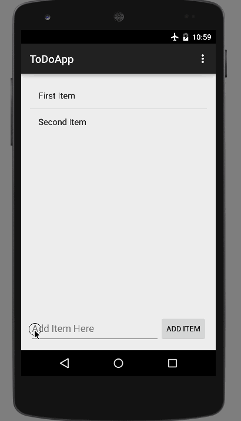

# ToDo App

This is an Android application for submission to CodePath.  This follows the [CodePath Prework instructions](http://courses.codepath.com/snippets/intro_to_android/prework).

Time spent: around 20 hours spent in total

Completed user stories:

 * [x] Required: Setup your Android environment
 * [x] Required: Build initial todo app
       * [x] Required: Add the ability to create an item in the todo app
       * [x] Required: Add the ability to delete an item in the todo app with long press
       * [x] Required: Add the ability to save the list to a file that will load on start
 * [x] Required: Add edit functionality to todo app
 * [x] Required: Submit todo app for review via Github
 
 
Walkthrough of all user stories:

GIF created with [LiceCap](http://www.cockos.com/licecap/).